# Orders Microservice

Example of Orders Microservice applying Hexagonal Architecture pattern, Domain Driven Design (DDD) and SOLID principles.

This example was implemented with Spring Boot, PostgreSQL. The microservices and the DB are deployed locally.

### Start a PostgreSQL Server 

1. Start a PostgreSQL server instance with Docker Hub

```shell
jmendoza@jmendoza-ThinkPad-T420:~$ docker run -d --name postgres -e POSTGRES_PASSWORD=root.jmtizure.k201 postgres
```

2. Start pgAdmin 4 (Container), is a GUI client for PostgreSQL
```shell
jmendoza@jmendoza-ThinkPad-T420:~$ docker run --name pgadmin4 -p 5050:80 -e "PGADMIN_DEFAULT_EMAIL=jmtizure@gmail.com" -e "PGADMIN_DEFAULT_PASSWORD=123456789" -d  dpage/pgadmin4
```

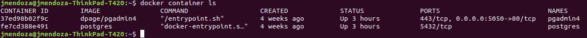

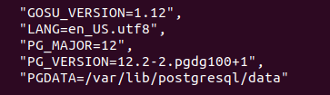

3. Create a new "customers" database

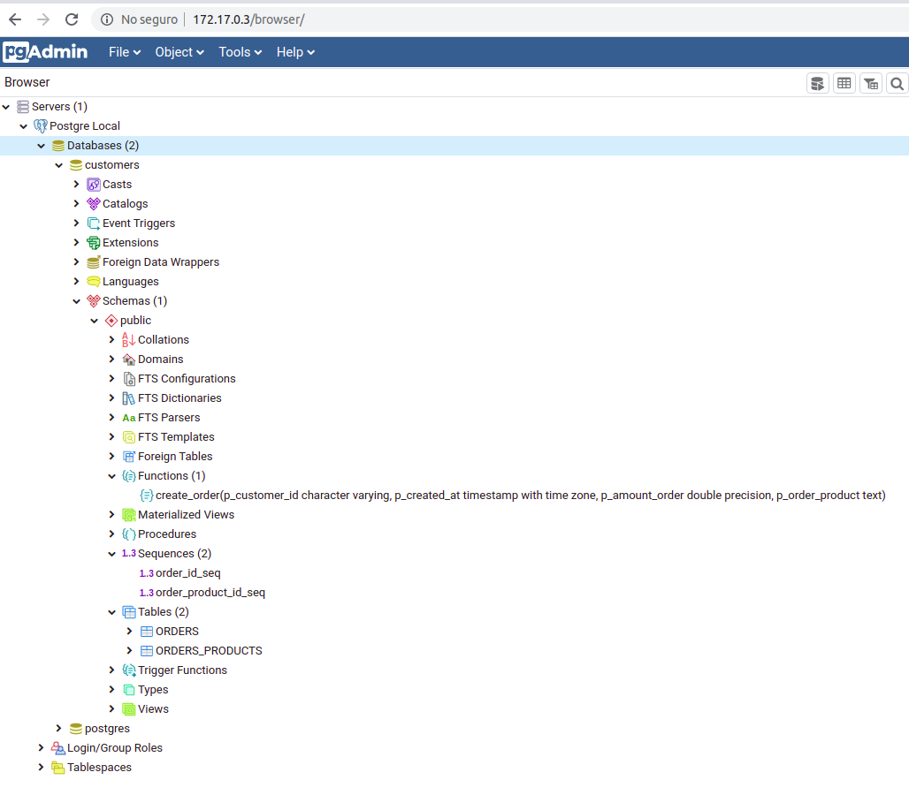

4. Execute the following scripts in the public schema.

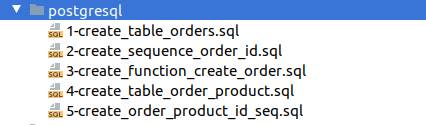

## Configure your application.properties

Find the IP address of your postgres container

```shell
jmendoza@jmendoza-ThinkPad-T420:~$ docker inspect postgres
```

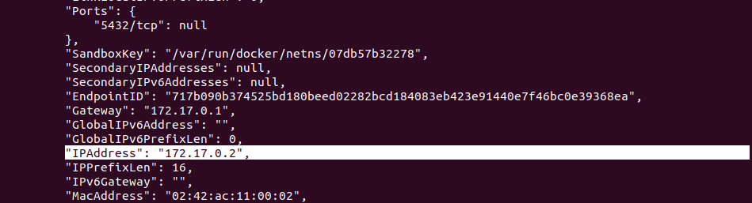

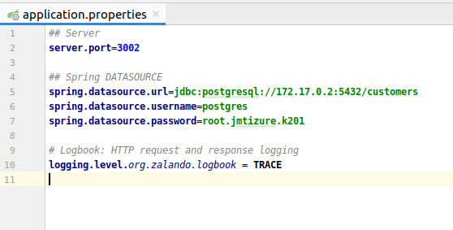

## Create Order

**Postman**

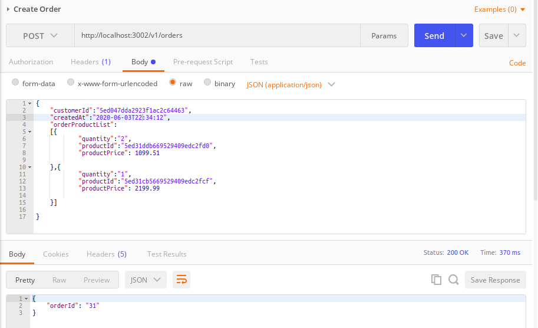

```shell
[2020-06-03 22:35:27.350] [TRACE] [jmendoza-ThinkPad-T420] [http-nio-3002-exec-1] [zalando.logbook.Logbook] | {"origin":"remote","type":"request","correlation":"ab783ac9bce46b82","protocol":"HTTP/1.1","remote":"0:0:0:0:0:0:0:1","method":"POST","uri":"http://localhost:3002/v1/orders","headers":{"accept":["*/*"],"accept-encoding":["gzip, deflate, br"],"accept-language":["es-419,es-US;q=0.9,es;q=0.8,en-US;q=0.7,en;q=0.6"],"cache-control":["no-cache"],"connection":["keep-alive"],"content-length":["304"],"content-type":["application/json"],"host":["localhost:3002"],"origin":["chrome-extension://fhbjgbiflinjbdggehcddcbncdddomop"],"postman-token":["32678e26-1a2d-450e-865d-5ea8429540ac"],"sec-fetch-dest":["empty"],"sec-fetch-mode":["cors"],"sec-fetch-site":["none"],"user-agent":["Mozilla/5.0 (X11; Linux x86_64) AppleWebKit/537.36 (KHTML, like Gecko) Chrome/83.0.4103.61 Safari/537.36"]},"body":{"customerId":"5ed047dda2923f1ac2c64463","createdAt":"2020-06-03T22:34:12","orderProductList":[{"quantity":"2","productId":"5ed31ddb669529409edc2fd0","productPrice":1099.51},{"quantity":"1","productId":"5ed31cb5669529409edc2fcf","productPrice":2199.99}]}}
[2020-06-03 22:35:27.513] [TRACE] [jmendoza-ThinkPad-T420] [http-nio-3002-exec-1] [zalando.logbook.Logbook] | {"origin":"local","type":"response","correlation":"ab783ac9bce46b82","duration":255,"protocol":"HTTP/1.1","status":200,"headers":{"Connection":["keep-alive"],"Content-Type":["application/json"],"Date":["Thu, 04 Jun 2020 02:35:27 GMT"],"Keep-Alive":["timeout=60"],"Transfer-Encoding":["chunked"]},"body":{"orderId":"31"}}
```

**PostgreSQL**

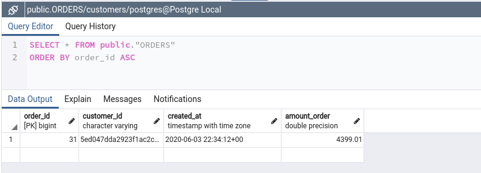

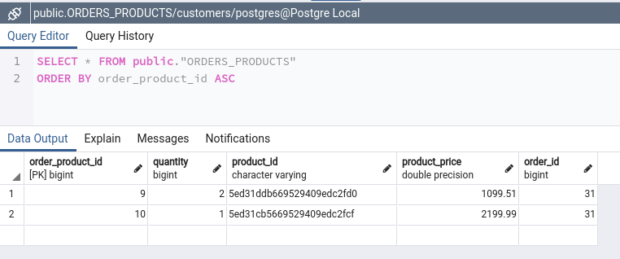

## Get Orders

**Postman**

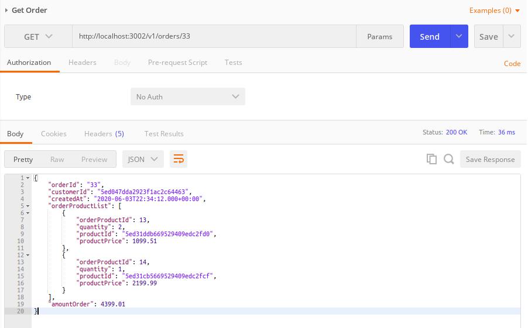

**PostgreSQL**

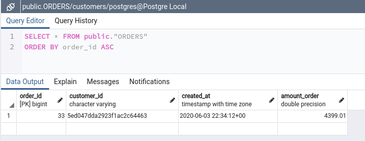

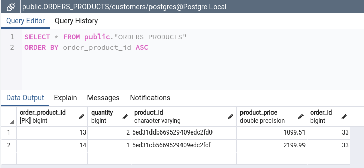

```shell
[2020-06-04 21:52:50.882] [TRACE] [jmendoza-ThinkPad-T420] [http-nio-3002-exec-7] [zalando.logbook.Logbook] | {"origin":"remote","type":"request","correlation":"91d731033f99fbed","protocol":"HTTP/1.1","remote":"0:0:0:0:0:0:0:1","method":"GET","uri":"http://localhost:3002/v1/orders/33","headers":{"accept":["*/*"],"accept-encoding":["gzip, deflate, br"],"accept-language":["es-419,es-US;q=0.9,es;q=0.8,en-US;q=0.7,en;q=0.6"],"cache-control":["no-cache"],"connection":["keep-alive"],"host":["localhost:3002"],"postman-token":["8fe08c78-dcb0-9f1e-a0a8-62f731d232a4"],"sec-fetch-dest":["empty"],"sec-fetch-mode":["cors"],"sec-fetch-site":["none"],"user-agent":["Mozilla/5.0 (X11; Linux x86_64) AppleWebKit/537.36 (KHTML, like Gecko) Chrome/83.0.4103.61 Safari/537.36"]}}
[2020-06-04 21:52:50.893] [TRACE] [jmendoza-ThinkPad-T420] [http-nio-3002-exec-7] [zalando.logbook.Logbook] | {"origin":"local","type":"response","correlation":"91d731033f99fbed","duration":11,"protocol":"HTTP/1.1","status":200,"headers":{"Connection":["keep-alive"],"Content-Type":["application/json"],"Date":["Fri, 05 Jun 2020 01:52:50 GMT"],"Keep-Alive":["timeout=60"],"Transfer-Encoding":["chunked"]},"body":{"orderId":"33","customerId":"5ed047dda2923f1ac2c64463","createdAt":"2020-06-03T22:34:12.000+00:00","orderProductList":[{"orderProductId":13,"quantity":2,"productId":"5ed31ddb669529409edc2fd0","productPrice":1099.51},{"orderProductId":14,"quantity":1,"productId":"5ed31cb5669529409edc2fcf","productPrice":2199.99}],"amountOrder":4399.01}}
```
