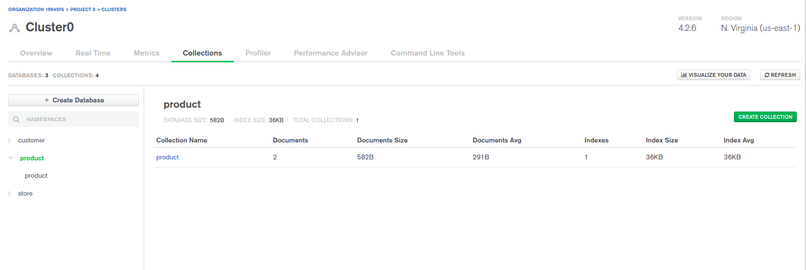
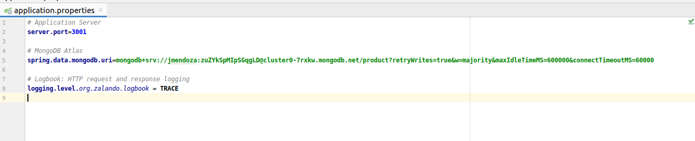
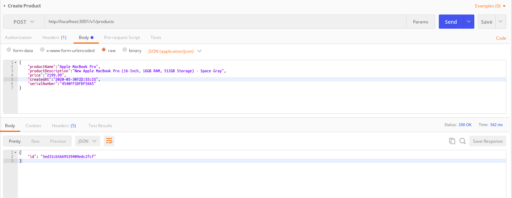
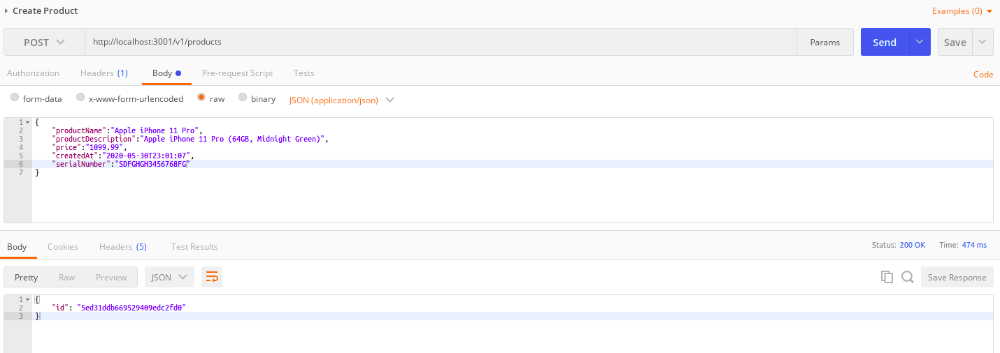
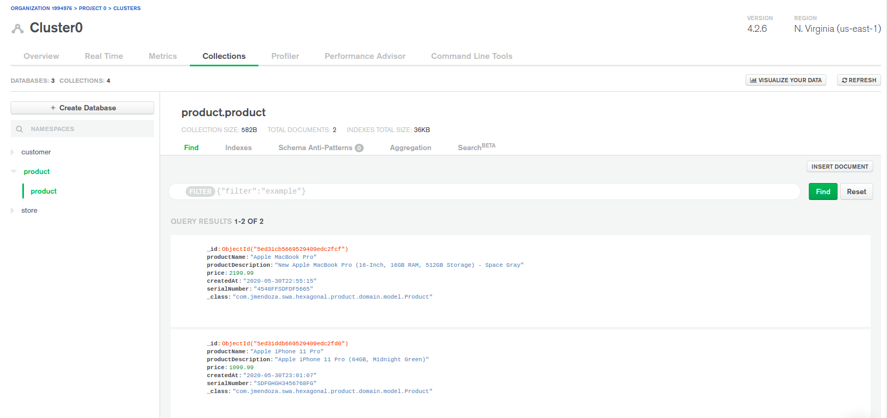
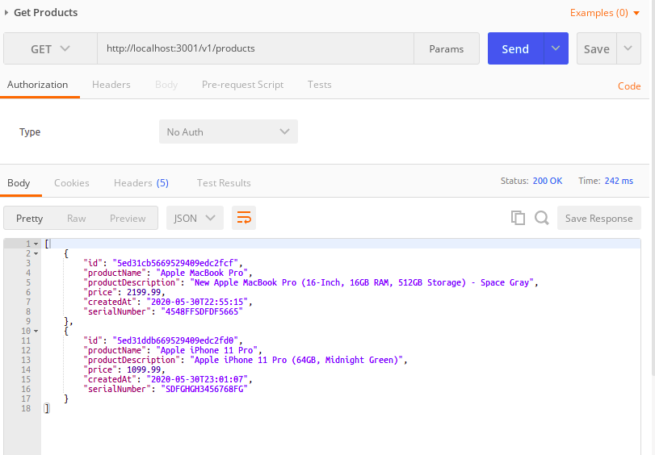

# Products Microservice

Example of Products Microservice applying Hexagonal Architecture pattern, Domain Driven Design (DDD) and SOLID principles.

This example was implemented with Spring Boot, MongoDB Atlas. The microservices are deployed locally and the DB in the cloud.

## MongoDB Atlas
- Signup free at https://www.mongodb.com/cloud/atlas/signup 
- Create DATABASE and COLLECTION (Optional)
- Create Database User
- Add your IP Address (public) in IP Whitelist, Network Access

## Configure your application.properties

## Create Products

**Postman**

**MongoDB Atlas**

## Get Products

**Postman**

