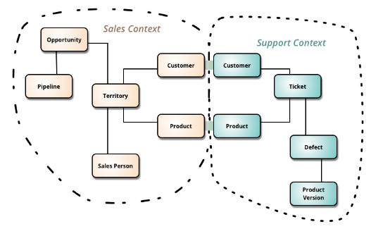
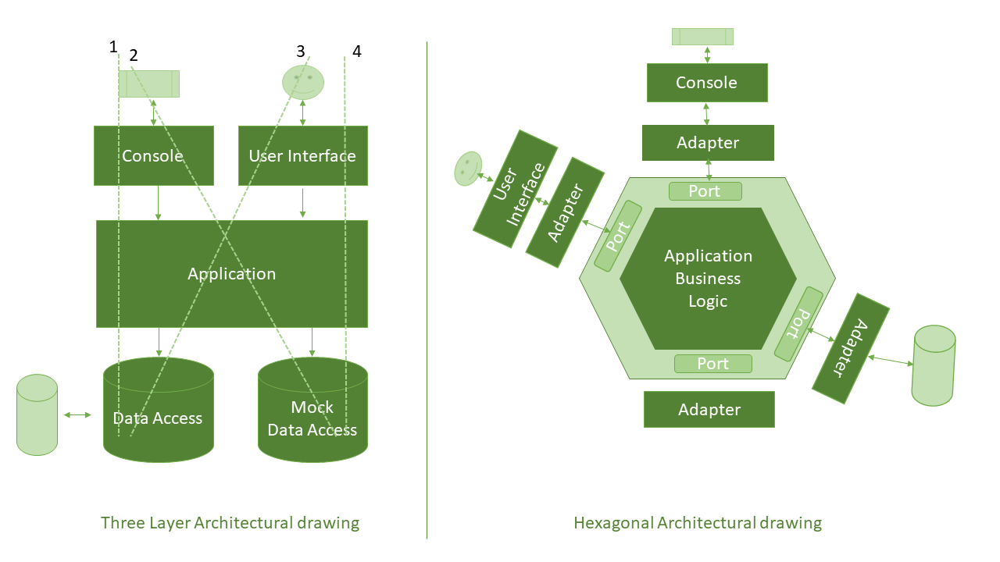
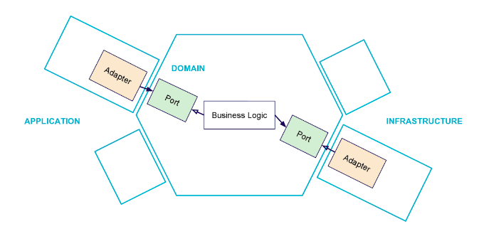

# Hexagonal-Architecture-DDD

Example of how to use Domain Driven Design (DDD) and Hexagonal Architecture with Microservices. 

This example is made with Spring Boot and MongoDB.

## Domain Driven Design (DDD)

Domain-Driven Design is an approach to software development that centers the development on programming a domain model that has a rich understanding of the processes and rules of a domain.

Bounded Context is a central pattern in Domain-Driven Design. It is the focus of DDD's strategic design section which is all about dealing with large models and teams. DDD deals with large models by dividing them into different Bounded Contexts and being explicit about their interrelationships.

*Reference:*
- https://martinfowler.com/tags/domain%20driven%20design.html

## Hexagonal Architecture

The hexagonal architecture, or ports and adapters architecture, is an architectural pattern used in software design. It aims at creating loosely coupled application components that can be easily connected to their software environment by means of ports and adapters. This makes components exchangeable at any level and facilitates test automation.

The business logic interacts with other components through ports and adapters. This way, we can change the underlying technologies without having to modify the application core.

**The hexagonal architecture is based on three principles and techniques:**

1. Explicitly separate Application, Domain, and Infrastructure
2. Dependencies are going from Application and Infrastructure to the Domain
3. We isolate the boundaries by using Ports and Adapters

Note: The words Application, Domain and Infrastructure do not come from the original article but from the frequent use of hexagonal architecture by Domain-Driven Design practitioners. 

### Domain Layer

- The domain layer represents the inside of the application and provides ports to interact with application use cases.

- This is the part that we want to isolate from both left and right sides. It contains all the code that concerns and implements business logic (use cases).
 
- Because domain objects have no dependencies on other layers of the application, changes in other layers don’t affect them.

### Application Layer

- 

*Reference:*
- https://en.wikipedia.org/wiki/Hexagonal_architecture_(software)
- https://dzone.com/articles/hexagonal-architecture-in-java-2
- https://blog.octo.com/en/hexagonal-architecture-three-principles-and-an-implementation-example/#principles

